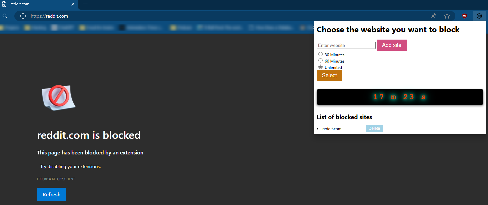

# Simplified Website Blocker
This Chrome extension allows users to block specific websites and set a countdown timer to automatically unblock them after a specified period. It provides options for blocking websites for 30 minutes, 60 minutes, or indefinitely ("unlimited" time).



## Features
- Website Blocking: Users can block specific websites, preventing access to them in the browser.
- Countdown Timer: Users can set a timer (30 minutes, 60 minutes, or unlimited) after which the blocked sites will be automatically unblocked.

## Installation
1. Clone or download the repo:
```bash
git clone https://github.com/duyhuynh02/simplified-web-blocker.git 
cd simplified-web-blocker
```

2. Load the Extension in Chrome:
- Open Chrome and navigate to chrome://extensions/.
- Enable "Developer mode" in the top-right corner.
- Click "Load unpacked" and select the project directory.

3. Use the Extension:
- Click the extension icon in the Chrome toolbar.
- Add websites to the block list by entering the URL and clicking "Add Site."
- Select a countdown timer option and click "Set Timer."
- Manage the block list and timer settings as needed.

## Contributing
If you have suggestions or want to contribute to the project, feel free to fork the repository and submit a pull request.

## License
This project is licensed under the MIT License.


# Tasks list
- [x] Set up manifest, popup, icon and background.js file 
- [x] Preparation for html popup
- [x] button id = addSite; id for each ul -> siteList 
- [x] Complete popup.js -> get all the blocked websites 
- [x] Complete background.js -> block website function 
- [x] Show list of blocked websites 
- [x] Remove blocked websites 
- [x] Add a time (30 - 60) for leisure time 
- [x] Clear existing after add new site 
- [x] Show the new blocked website immediately 
- [x] Block websites during certain time 


